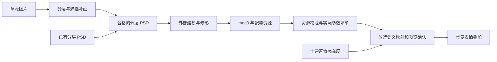

# 图片到 Live2D 与情感映射：研究和实践路线

核查日期：2026-09-13。本文是后续开发路线，不表示这些能力已随 V1.9 实现。本次读取了上游源码、GitHub 提交与发行记录、官方文档以及本项目现有情感边界；没有运行第三方程序、下载模型、导入角色或验证生成模型的实际观感。

建议先走**已有分层 PSD → 外部建模工具 → Cubism 模型 → 桌宠参数清单与映射**。单张图片需要额外解决分层、遮挡补画和结构修复；emotion-engine 则属于情感状态计算，与图片建模是两条独立工作线。第一轮不需要部署新的 LLM、图像模型或持久记忆服务。

## 1. 已核对的版本与能力边界

下表中的日期是所查默认分支提交日期；最近有提交仅是维护活动证据，不代表稳定性或兼容性保证。

| 项目           | 本次核对的源码与发行                                                                                                                                                                                                                      | 许可证  | 实际作用                                                                           |
| -------------- | ----------------------------------------------------------------------------------------------------------------------------------------------------------------------------------------------------------------------------------------- | ------- | ---------------------------------------------------------------------------------- |
| emotion-engine | main [`bc0350c`](https://github.com/fenghua2006/emotion-engine/commit/bc0350c6a3870e359db135a249e5212086d810e7)，2026-06-30；[v0.6](https://github.com/fenghua2006/emotion-engine/releases/tag/v0.6) 同日发布，README 的架构章节仍写 v0.5 | MIT     | 评价事件到情绪状态、记忆和提示词；不生成或绑定 Live2D                              |
| psd2live       | master [`9b74032`](https://github.com/tsunehimatoi/psd2live/commit/9b74032231f9a7d3282c6701b4d91d15da610543)，2026-09-12；[v0.6.0](https://github.com/tsunehimatoi/psd2live/releases/tag/v0.6.0) 发布于 2026-09-08                        | GPL-3.0 | 分层 PSD 自动建模，生成编辑工程与运行时模型；源码较发行版多了 PSD 重复图层 ID 修复 |

以上两个仓库在查询时均未归档。复现必须记录具体版本及文件哈希，不能把当前源码中的修复算作旧发行包已经具备的能力。许可证以各仓库 [emotion-engine LICENSE](https://github.com/fenghua2006/emotion-engine/blob/bc0350c6a3870e359db135a249e5212086d810e7/LICENSE) 和 [psd2live LICENSE](https://github.com/tsunehimatoi/psd2live/blob/9b74032231f9a7d3282c6701b4d91d15da610543/LICENSE) 为准。

## 2. emotion-engine：通道能对齐，状态语义需要适配

上游 `Appraisal` 接收目标相关性、利害、预期、他者责任、应对能力、社会评价等数值；`tick` 更新状态。通道恰好也是 `joy / sadness / anger / fear / disgust / surprise / trust / love / longing / guilt`。其状态包含快慢变化及离线演化，不只是一次回复的表情强度。[接口与状态实现](https://github.com/fenghua2006/emotion-engine/blob/bc0350c6a3870e359db135a249e5212086d810e7/engine.py)

本项目 [emotion-channels.ts](../src/core/character/emotion-channels.ts) 的十通道是单次回复的有限 `[0,1]` 数值，明确不等同于持久关系分数。因此名称相同可以减少转换成本，但不能直接替换类型或把 `trust/love` 自动变成用户关系数据库。

一个可复现的范围差异：上游 `felt` 使用 `log10(1 + 2 × raw)`，`raw = 5` 时约为 `1.0414`，超过本项目解析器接受范围。后续适配应保留原始状态与显示强度的区别，选定并校准单调归一化函数，再验证有限性和范围。例如 `felt / (1 + felt)` 只是候选方案，尚未采用；还需检查弱情绪灵敏度、饱和区与退场时间。不能因十个字段同名就直接透传。

上游的完整演示还有明显不同的权限与存储设计：SQLite 记忆、状态快照与敏化记录；dashboard 会保存 JSON 状态和聊天记录、监听 `0.0.0.0`、动态导入 Python 角色模块；引擎包含自己的 LLM 提示构造和提供商回退。已检查的 SQLite 表没有角色命名空间字段。以上均是代码行为，不代表已经在本机执行或发生数据泄露。[引擎存储与请求逻辑](https://github.com/fenghua2006/emotion-engine/blob/bc0350c6a3870e359db135a249e5212086d810e7/engine.py)、[dashboard 实现](https://github.com/fenghua2006/emotion-engine/blob/bc0350c6a3870e359db135a249e5212086d810e7/dashboard/server.py)

适合本项目的第一步是研究其纯数值模型，并在现有类型边界内做小型、无网络的适配试验：

- 只用合成事件、假时钟和内存状态；状态归属于明确的角色及会话上下文，切换或销毁时可重置。
- Main 继续独占提供商、密钥、记忆和磁盘。不要引入上游 dashboard、Python 动态角色插件、另一个聊天日志或静默提供商回退。
- 持久化属于后续独立设计：必须有版本迁移、角色隔离、删除语义及显式产品说明，不借“情绪”默默保存私人对话。
- 先测事件序列、衰减、取消和恢复，再由人判断表现是否自然。数值符合公式不证明角色心理真实，也不等于用户接受其关系表达。

纯数值部分使用 Python 标准库，所查实现未要求 GPU；若加入事件评价 LLM、聊天或语音，费用和延迟来自那些额外组件。本次没有测量每次更新耗时，不能给出性能保证。

## 3. psd2live：能生成 moc3，但输入仍是分层素材

### PSD 与单张图片的差别

分层 PSD 可以提供独立的眼、眉、嘴、头发、身体和透明遮挡关系。平面 PNG/JPEG 只有合成后的像素，缺少被遮住的脸、发根或嘴内区域，也没有“哪个像素属于哪个部件”的编辑结构。把单图放进一个 PSD 图层不会补齐这些信息。

psd2live 依赖图层语义、左右侧别及适合变形的画法；上游特别说明正立构图、嘴部与睫毛准备要求，并承认自动修画及精细变形仍有局限。不能承诺任意图片一键成为可用模型。[固定版本图层规范](https://github.com/tsunehimatoi/psd2live/blob/9b74032231f9a7d3282c6701b4d91d15da610543/docs/zh/PSD_LAYER_SPEC.md)、[项目说明与局限](https://github.com/tsunehimatoi/psd2live/blob/9b74032231f9a7d3282c6701b4d91d15da610543/README.md)

官方 Cubism 的 PSD 准备规范同样要求按部件整理绘画内容，并说明 RGB、8 bit、sRGB、合并图层效果和蒙版等注意事项。应先验收输入素材，再判断建模工具的输出。[Live2D 官方 PSD 准备规范](https://docs.live2d.com/en/cubism-editor-manual/precautions-for-psd-data/)

### 是真正的 moc3 导出路径吗

**源码中存在实际的 moc3 二进制生成路径。** `Moc3.write` 调用 `MocEncoder.bakeFresh(model.version, model)`，并有独立编码器和 CMO3 writer；仓库还保存了示例模型及配套文件。因此其实现目标确实包括 Cubism 模型，不只是把动态视频命名为 moc3。[Moc3 codec](https://github.com/tsunehimatoi/psd2live/blob/9b74032231f9a7d3282c6701b4d91d15da610543/src/main/kotlin/org/umamo/format/moc3/Moc3.kt)、[示例文件目录](https://github.com/tsunehimatoi/psd2live/tree/9b74032231f9a7d3282c6701b4d91d15da610543/examples/ds/moc3-cmo3-output)

这仍不证明所有输出都能被当前桌宠使用的 Cubism Core 正确加载，也不证明遮罩、物理和形变质量合格。需要分别验证 `.cmo3` 能否继续编辑，以及 `.moc3`、`model3.json`、纹理、物理和动作能否作为完整资源包运行。官方区分编辑工程和运行时导出，并要求准备纹理图集。[官方运行时导出说明](https://docs.live2d.com/en/cubism-editor-manual/export-moc3-motion3-files/)

### 成本和集成选择

源码构建配置是 JDK 21 工具链；应用配置了 `-Xmx8g`，它是 JVM 堆上限，不是实测占用或最低内存要求。Windows 发行包附带 Java。基础 PSD 建模与可选 AI 修画应分别计量；后者的图像生成和反复调整成本不能算作零。[构建配置](https://github.com/tsunehimatoi/psd2live/blob/9b74032231f9a7d3282c6701b4d91d15da610543/build.gradle.kts)、[发行说明](https://github.com/tsunehimatoi/psd2live/releases/tag/v0.6.0)

本仓库安全规范禁止复制 GPL 代码，所以建议将 psd2live 保持为用户独立使用的外部创作工具，只验证、导入最终模型文件。不要把它的源码、MCP 服务或可执行文件顺带嵌入桌宠。上游也明确没有附带官方 Cubism SDK；可选官方运行时需要另外配置。源码许可、SDK 条款、模型权重和原画授权需要各自核对，不能由一个仓库的许可证代替。[第三方声明](https://github.com/tsunehimatoi/psd2live/blob/9b74032231f9a7d3282c6701b4d91d15da610543/THIRD_PARTY_NOTICES.md)、[SDK 配置说明](https://github.com/tsunehimatoi/psd2live/blob/9b74032231f9a7d3282c6701b4d91d15da610543/docs/zh/CUBISM_SDK_SETUP.md)、[本项目安全规范](SECURITY_CODING_STANDARD.md)

## 4. 类似项目与实际用途

| 候选                                                                                | 输入、输出与用途                                                                                                  | 成本和限制                                                                                                                           | 核对版本与许可                                                                                                                                                                                               |
| ----------------------------------------------------------------------------------- | ----------------------------------------------------------------------------------------------------------------- | ------------------------------------------------------------------------------------------------------------------------------------ | ------------------------------------------------------------------------------------------------------------------------------------------------------------------------------------------------------------ |
| [Qwen-Image-Layered](https://github.com/QwenLM/Qwen-Image-Layered)                  | 单图拆成多个 RGBA 层，示例界面可导出 PSD；适合补齐前置分层环节，不导出 moc3                                       | 官方模型为 20B，示例使用 CUDA/bfloat16；本次未验证本机显存、AMD 兼容性或耗时。模型并非按提示严格指定每层语义，仍需整理部件和补画遮挡 | [`54c4fe4`](https://github.com/QwenLM/Qwen-Image-Layered/commit/54c4fe47e76d745775e03fc66ee38457280ed9ea)，2025-12-31；代码与官方模型标 Apache-2.0；[模型卡](https://huggingface.co/Qwen/Qwen-Image-Layered) |
| [Talking Head Anime 3 demo](https://github.com/pkhungurn/talking-head-anime-3-demo) | 512×512、透明背景的正面人物图，以姿态控制神经网络输出画面；适合“单图动起来”的独立渲染路线，不是可编辑 Cubism 模型 | 逐帧神经推理；仓库环境说明较旧，当前硬件与依赖兼容性未测。画面构图有要求，不能直接替换现有 Live2D 资源加载器                         | [`8946939`](https://github.com/pkhungurn/talking-head-anime-3-demo/commit/8946939ec7b417f443d7b0e3fcd97384313fcdb8)，2023-01-21；代码 MIT、权重 CC-BY-4.0，示例画作另有许可                                  |
| [live2d-psd-template](https://github.com/284km/live2d-psd-template)                 | YAML 定义生成 PSD 图层模板；适合人工分层时统一命名与检查清单                                                      | Node 20+，使用 ag-psd/canvas；不画图、不自动拆图，也不绑定或导出 moc3                                                                | [`19102c7`](https://github.com/284km/live2d-psd-template/commit/19102c751a7d4f02da72a0f9c1e2a35b82eaf3d5)，2026-04-25；MIT                                                                                   |

这三种工具分处不同环节，不应按“都能让图片动起来”视为同一种替代品。当前优先级是用已有分层 PSD 验证建模及播放闭环，再决定是否值得投入大模型分层。上表没有把项目声明换算成实测成本或本机兼容性结论。

## 5. 参数发现与语义映射应分开验收

机械参数清单可以自动化：枚举实际 ID、最小值、最大值、默认值，并记录模型指纹。官方 `.cdi3.json` 可以补充参数名称、分组及部件名称，这些显示信息不在 moc3 内。它能提供线索，但不等于机器已经理解了每个自定义参数的视觉含义。[官方 CDI3 说明](https://docs.live2d.com/en/cubism-sdk-manual/cdi3json/)

建议按证据分三级处理：

1. **存在性已确认**：只接受 Core 枚举得到的真实参数；缺失参数不能通过会创建虚拟槽位的查找路径“补出来”。范围和默认值先校验，异常参数退出候选集。
2. **语义有依据**：标准 ID、可信的映射元数据、CDI3 显示名称、已有 exp3/motion3 提供候选。记录映射来源与可信程度；同名参数也需要看实际动作。
3. **语义待确认**：`Param100` 等未知参数通过单参数最小值/中立/最大值的受限预览确认，离页、取消、换模型后恢复原状态。无法确认就保留未知，不能自动赋予“爱”“生气”等解释。

现有 [emotion-overlay.ts](../src/renderer/live2d/emotion-overlay.ts) 已检查真实参数范围，并使用嘴形、眉毛、眼睛开合等标准 ID；嘴巴张开由语音/动作控制。新的发现和映射应扩展这一边界，明确与口型、动作及物理的写入优先级，避免几个模块在同一帧争写。

十个情感通道不保证十套可见形变。模型可能只有少数可组合的眉眼嘴参数；应允许多个通道共享表现，标注覆盖不足并自然回退。没有绘制或绑定的形变不能靠参数枚举生成。模型变更后按指纹失效旧映射，防止旧数值范围误用于新模型。

## 6. 可执行阶段与验收

以下阶段都是建议，尚未实施。每轮只改变一个环节，保存工具版本、输入输出哈希、命令或操作步骤及结果；自动检查与人工观感分别记录。

| 阶段              | 最小工作                                                                                         | 通过条件与停止条件                                                                                                                                         |
| ----------------- | ------------------------------------------------------------------------------------------------ | ---------------------------------------------------------------------------------------------------------------------------------------------------------- |
| A：建立输入样例   | 一份自有或授权明确的简单分层 PSD，包含可分别检查的眼、眉、嘴与头发；先检查命名、透明度和合成效果 | 输入权利和部件结构可核查。缺少关键画层先修素材，不用扩大生成次数掩盖输入问题                                                                               |
| B：外部建模闭环   | 固定 psd2live 版本，生成 cmo3 与运行时文件；需要时在 Cubism Editor 修形                          | 官方 Viewer 与本项目实际 Core 均能加载；检查中立、眨眼、嘴形、头转、遮罩、头发物理与动作结束恢复。只在工具预览里能动不算通过；记录加载耗时、内存与模型体积 |
| C：参数清单与映射 | 在现有 Main 管理的资源边界内增加有限清单与声明式映射；先做标准 ID，再试一个未知参数              | 覆盖非法路径、文件数量/体积、缺失引用、非有限范围、模型变化、取消恢复；Renderer 不提交任意路径或代码。有效模型失败时仍可文字聊天和中立显示                 |
| D：情绪数值试验   | 合成事件进入独立适配器，输出本项目十通道；先不持久化                                             | 归一化、衰减、角色隔离、快切、取消后恢复均可重复；人工确认表现强度与退场自然。禁止以公式或测试通过代替观感结论                                             |
| E：单图分层试验   | 在 A—C 已通过后，对一张授权图片固定模型与参数做限量离线试验；例如先限制两轮，再决定是否继续      | 核对合成还原、身份一致性、透明边缘、遮挡补画和可用部件数；记录下载量、峰值内存/显存、耗时及人工修补工时。失败回到人工分层，不宣称“一键任意图建模”          |

运行时文件应由受管理资源入口校验，拒绝越界路径、可执行内容与不受控引用；模型本身能成功解析仍不足以跳过资产许可审查。官方 Core 的版本/完整性接口以及官方 Viewer 可以作为独立兼容性证据。[Cubism Core API](https://docs.live2d.com/en/cubism-sdk-manual/cubism-core-api-reference/)、[官方 Viewer](https://docs.live2d.com/en/cubism-editor-manual/cubism3-viewer-for-ow/)

下一项最有价值的实践是阶段 A—B：拿一份授权明确的分层 PSD，验证外部工具产出的模型确实能进入现有桌宠，并记录实际缺失参数和观感问题。先获得这个模型样例，后续自动映射才有可验收对象；单图生成和持久情感都不应成为这个最小闭环的前置依赖。
